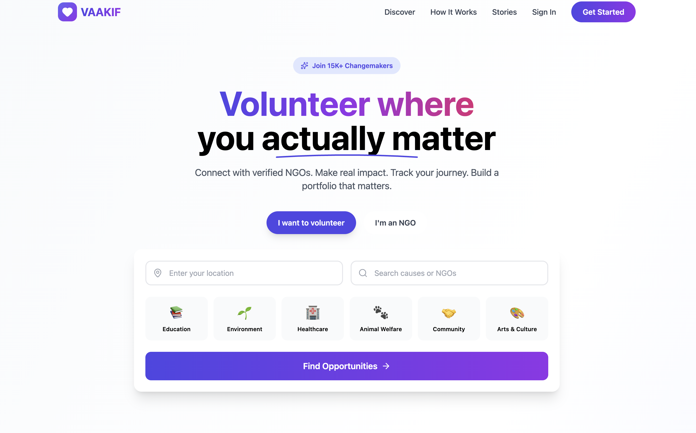

# 🌱 VAAKIF — Volunteer–NGO Connection Platform

VAAKIF is a web platform designed to connect volunteers with verified NGOs for **offline volunteering opportunities**.  
The project focuses on building a modern, Gen-Z friendly user experience with clean design, smooth animations, and intuitive discovery of opportunities.

This repository currently contains the **frontend implementation**, with backend and AI features planned as part of the full-stack roadmap.

---

## 🚀 Features (Frontend Implemented)

- 🔍 Discover volunteering opportunities by category, location, schedule, and duration  
- 🎨 Modern, responsive UI built for Gen-Z users  
- ✨ Smooth scroll-based animations and micro-interactions  
- 📊 Animated impact counters (e.g., volunteers onboarded, NGOs registered)  
- 🧭 “How It Works” section for volunteers and NGOs  
- 💬 Horizontally scrollable testimonials section  
- 📱 Mobile-first and accessible design  

---

## 🛠️ Tech Stack

**Frontend**
- React.js  
- JavaScript (ES6+)  
- Tailwind CSS  
- Framer Motion  
- React Router  

**Tools**
- Git & GitHub  
- Figma  
- Canva  

---

## 🧠 Planned Features (Backend & AI – In Progress)

- NGO registration and document verification workflow  
- Volunteer and NGO dashboards  
- Event creation and RSVP management  
- Role-based authentication  
- AI-based volunteer–NGO matching  
- Chatbot assistant for onboarding and discovery  

---

## 📂 Project Structure

vaakif/
│
├── src/
│ ├── components/
│ ├── pages/
│ ├── layouts/
│ ├── hooks/
│ └── assets/
│
├── README.md
└── package.json

---

---

## 🌐 Screenshots

### Hero Section

---

## 📌 Project Status

- ✅ Frontend UI and interactions completed  
- 🚧 Backend and AI features under development  

